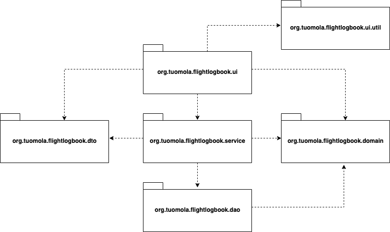
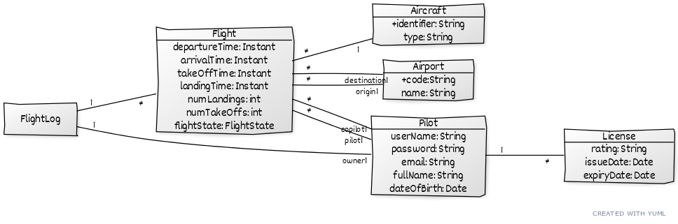
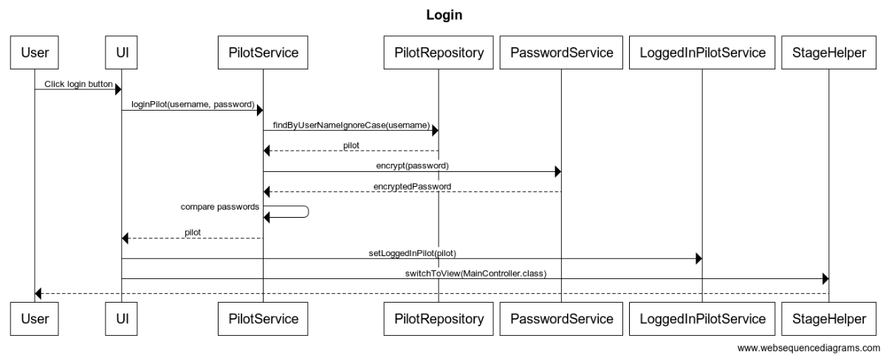
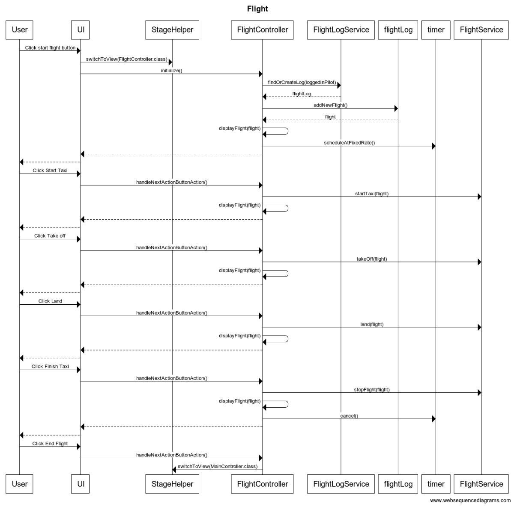
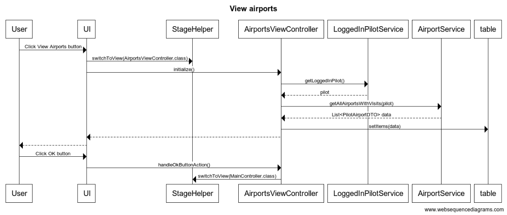

# Arkkitehtuurikuvaus

## Rakenne

Ohjelman rakenne noudattelee kolmitasoista kerrosarkkitehtuuria, ja koodin pakkausrakenne on seuraava:

Pakkauksien sisältö on seuraavaa:

- _org.tuomola.flightlogbook.ui_ sisältää käyttöliittymän toteutettuna JavaFX:llä 
- _org.tuomola.flightlogbook.ui.util_ sisältää työkalu/apuluokkia käyttöliittymän toteutukseen 
- _org.tuomola.flightlogbook.service_ sisältää sovelluslogiikan
- _org.tuomola.flightlogbook.dto_ sisältää Data Transfer Objectit sovelluslogiikan ja käyttöliittymän väliseen kommunikaatioon. Näitä käytetään, kun sovelluslogiikka palauttaa rakenteista tietoa, joka ei ole osa itse domain-tietomallia. 
- _org.tuomola.flightlogbook.domain_ sisältää domain-tietomallin POJO:ina

- _org.tuomola.flightlogbook.dao_ sisältää tietojen pysyväistallennuksesta vastaavan koodin (toteutettu JPA:lla)

Ohjelman logiikka tukeutuu Spring-kirjastoihin (Spring, Spring Boot) riippuvuuksien automaattiseen injektointiin. 

## Käyttöliittymä

Ohjelman käyttöliittymä on toteutettu käyttäen JavaFX-kirjastoja ja FXML-määrittelytiedostoja. Niiden yhteentoimivuus Spring-kirjastojen kanssa on järjestetty FxWeaver-kirjastoa käyttäen.

Käyttöliittymä sisältää 7 erillistä näkymää:

- Sisäänkirjautuminen
- Uuden käyttäjän luominen
- Päänäkymä (lokin yhteenvetotiedot)
- Lentonäkymä (lennon aikainen käyttäliittymä)
- Lentotiedot
- Lentokenttätiedot
- Lentokonetiedot

Jokainen näistä on toteutettu omana FXML-tiedostona ja jokaiselle on oma kontrolleriluokka pakkauksessa _org.tuomola.flightlogbook.ui_. Näistä yksi on kerrallaan näkyvänä ja käytössä, ja sijoitettuna sovelluksen stageen.

Käyttöliittymä on täysin eristetty sovelluslogiikasta, ja se ainoastaan kutsuu sopivin parametrein sovelluslogiikkaa, joka sijaitsee pakkauksen _org.tuomola.flightlogbook.service_ luokissa. Sovelluslogiikka puolestaan käyttää DAO-luokkia (_org.tuomola.flightlogbook.dao_) tiedon tallennukseen / hakuun, ja kommunikoi logiikan toteutuksen tulokset käyttäen joko domain-mallin olioita (_org.tuomola.flightlogbook.domain_) tai Data Transfer-olioita (_org.tuomola.flightlogbook.dto_). 

## Sovelluslogiikka

Allaoleva kaavio näyttää sovelluksen loogisen datamallin: 

## Tietojen pysyväistallennus

Pakkauksen domain-tietomallin luokkien tieto talletetaan tietokantaan käyttäen JPA-rajapinnan toteuttavaa Hibernate-kirjastoa, ja Spring Data-frameworkiä. Näiden avulla tietoja voidaan hakea ja tallentaa pakkauksen _org.tuomola.flightlogbook.dao_ Repository-luokilla. Haettu tieto toimitetaan sovelluslogiikalle automaattisesti _org.tuomola.flightlogbook.domain_ pakkauksen @Entity-luokkia kättäen. 

Tietokantana sovelluksessa on käytössä H2. Taulut tietokantaan luodaan automaattisesti ensimmäisellä käyttökerralla, jos niitä ei vielä ole. Tietokanta talletetaan ohjelman kotihakemistoon nimellä _flightlogbook.db_. Jotta testauskerrat eivät vaikuta toisiinsa, testauksessa käytetään joka kerralla uutta vain muistissa sijaitsevaa tietokantaa. 

## Päätoiminnallisuudet

Kuvataan seuraavaksi sovelluksen toimintalogiikka muutaman päätoiminnallisuuden osalta sekvenssikaaviona.

### Käyttäjän kirjautuminen

Kun kirjautumisnäkymässä on syötetty käyttäjätunnus ja salasana, ja klikataan painiketta _loginButton_, etenee sovelluksen kontrolli seuraavasti:

Painikkeen painamiseen reagoiva tapahtumankäsittelijä kutsuu sovelluslogiikan _PilotService_ metodia _loginPilot_ antaen parametriksi kirjautuneen käyttäjätunnuksen ja salasanan. Sovelluslogikka selvittää _PilotRepository_:n avulla onko käyttäjätunnus olemassa. Jos on, se enkryptoi annetun salasanan _PasswordService_:n avulla, ja vertaa sitä talletettuun salasanaan. Mikäli nämä ovat sama, sovelluslogiikka palauttaa Pilot-olion käyttöliittymään. Käyttöliittymä asettaa tämänhetkiseksi käyttäjäksi palautetun _Pilot_-olion käyttämällä palvelua _LoggedInUserService_, ja vaihtaa näkymäksi _StageHelper_:iä käyttäen MainScenen.

### Lennon tallennus

Kun päänäkymästä klikataan painkiketta _Start flight_, etenee sovelluksen kontrolli seuraavasti: 

### Lentokenttätietojen katselu

Kun päänäkymästä klikataan painiketta _View airports_, etenee sovelluksen kontrolli seuraavasti: 

Kaikkien muiden lokitietojen (lentokoneet, lennot) katselutoimintojen toteutus seuraa samaa kaavaa - vain kontrolleriluokka ja lokista haettu tieto eroavat. 

