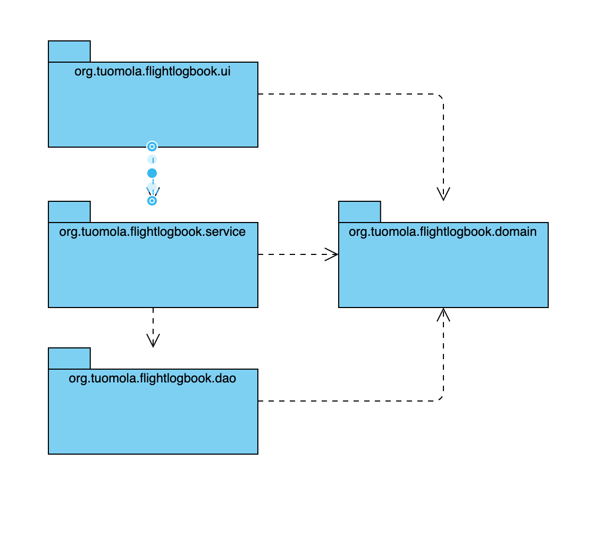
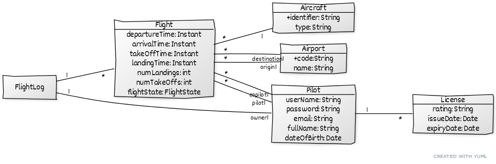

# Arkkitehtuurikuvaus

## Rakenne

Ohjelman rakenne noudattelee kolmitasoista kerrosarkkitehtuuria, ja koodin pakkausrakenne on seuraava:

Pakkauksien sisältö on seuraavaa:

- _org.tuomola.flightlogbook.ui_ sisältää käyttöliittymän - tällä hetkellä toteutettuna tekstikäyttöliittymänä, myöhemmin JavaFX:llä
- _org.tuomola.flightlogbook.service_ sisältää sovelluslogiikan
- _org.tuomola.flightlogbook.domain_ sisältää domain-tietomallin POJO:ina
- _org.tuomola.flightlogbook.dao_ sisältää tietojen pysyväistallenuksesta vastaavan koodin (toteutettu JPA:lla)

Ohjelman logiikka tukeutuu Spring-kirjastoihin (Spring, Spring Boot) riippuvuuksien automaattiseen injektointiin. 

## Käyttöliittymä

Ohjelman käyttöliittymä on toteutettu käyttäen JavaFX-kirjastoja ja FXML-määrittelytiedostoja. Niiden yhteentoimivuus Spring-kirjastojen kanssa on järjestetty FxWeaver-kirjastoa käyttäen.

Käyttöliittymä sisältää 4 erillistä näkymää:

- Sisäänkirjautuminen
- Uuden käyttäjän luominen
- Päänäkymä (lokin yhteenvetotiedot)
- Lentonäkymä (lennon aikainen käyttäliittymä)

Jokainen näistä on toteutettu omana FXML-tiedostona ja jokaiselle on oma kontrolleriluokka pakkauksessa _org.tuomola.flightlogbook.ui_. Näistä yksi on kerrallaan näkyvänä ja käytössä, ja sijoitettuna sovelluksen stageen.

Käyttöliittymä on täysin eristetty sovelluslogiikasta, ja se ainoastaan kutsuu sopivin parametrein sovelluslogiikkaa, joka sijaitsee pakkauksen _org.tuomola.flightlogbook.service_ luokissa.

## Sovelluslogiikka

Allaoleva kaavio näyttää sovelluksen loogisen datamallin: 

## Tietojen pysyväistallennus

Pakkauksen domain-tietomallin luokkien tieto talletetaan tietokantaan käyttäen JPA-rajapinnan toteuttavaa Hibernate-kirjastoa, ja Spring Data-frameworkiä. Näiden avulla tietoja voidaan hakea ja tallentaa pakkauksen _org.tuomola.flightlogbook.dao_ Repository-luokilla. Haettu tieto toimitetaan sovelluslogiikalle automaattisesti _org.tuomola.flightlogbook.domain_ pakkauksen @Entity-luokkia kättäen. 

Tietokantana sovelluksessa on käytössä H2. Taulut tietokantaan luodaan automaattisesti ensimmäisellä käyttökerralla, jos niitä ei vielä ole. Tietokanta talletetaan ohjelman kotihakemistoon nimellä _flightlogbook.db_. Jotta testauskerrat eivät vaikuta toisiinsa, testauksessa käytetään joka kerralla uutta vain muistissa sijaitsevaa tietokantaa. 

