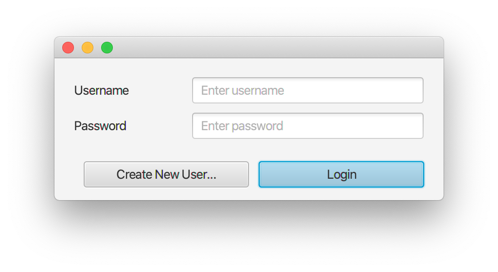
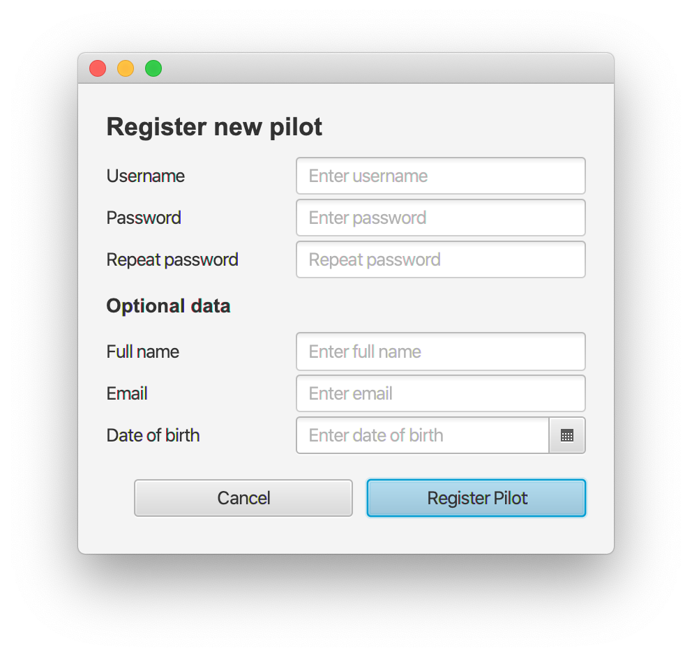
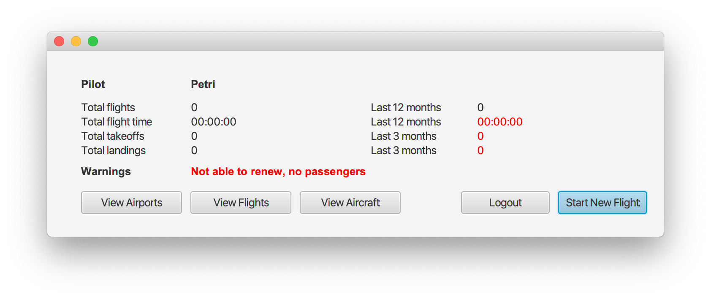
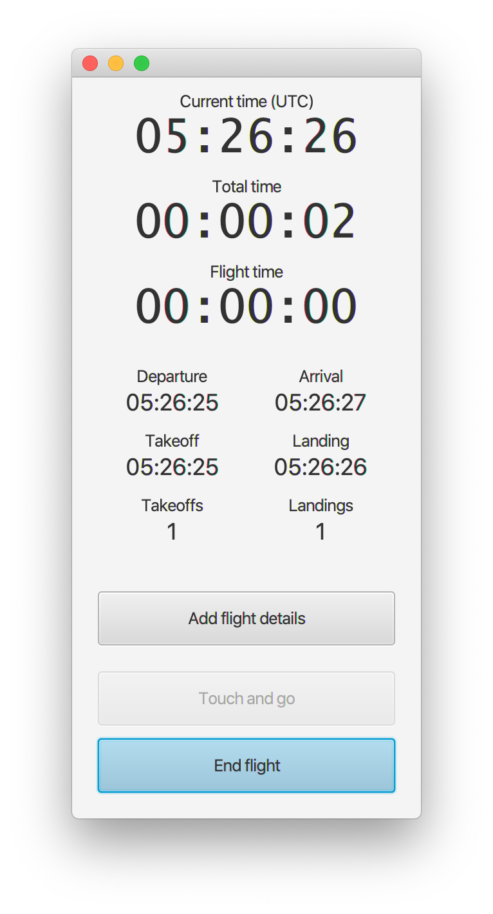
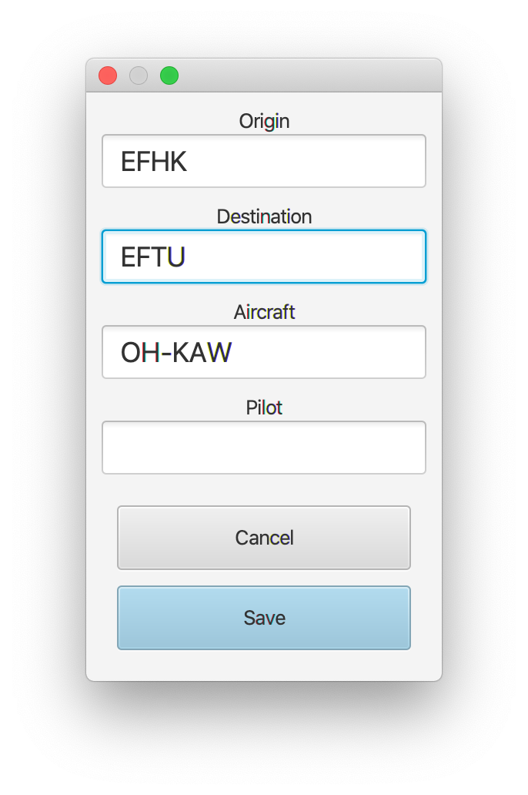
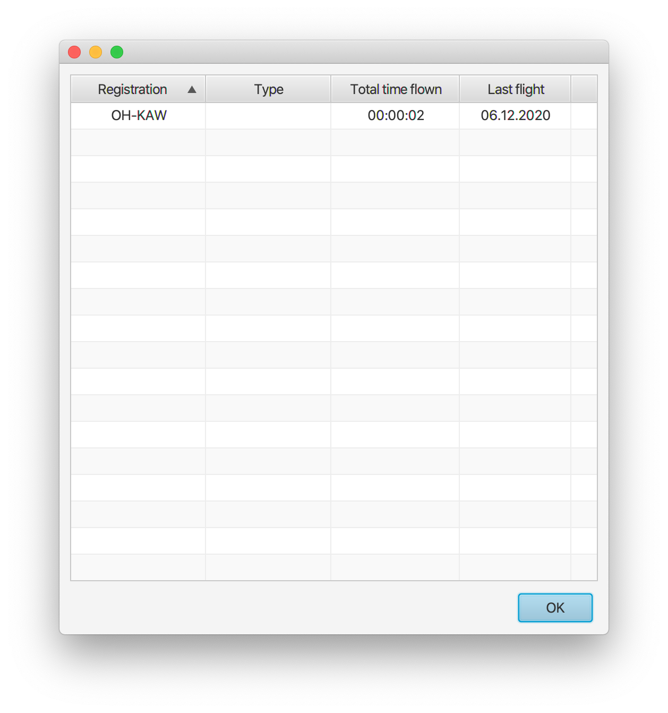
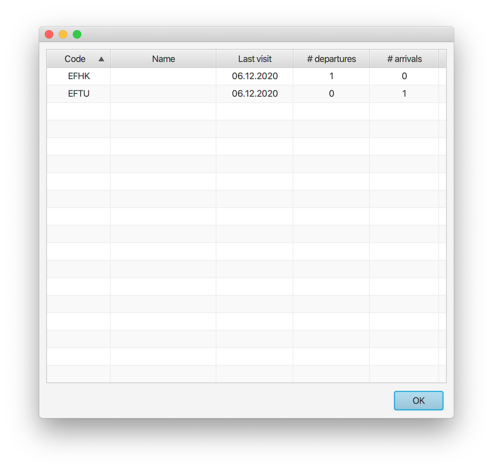
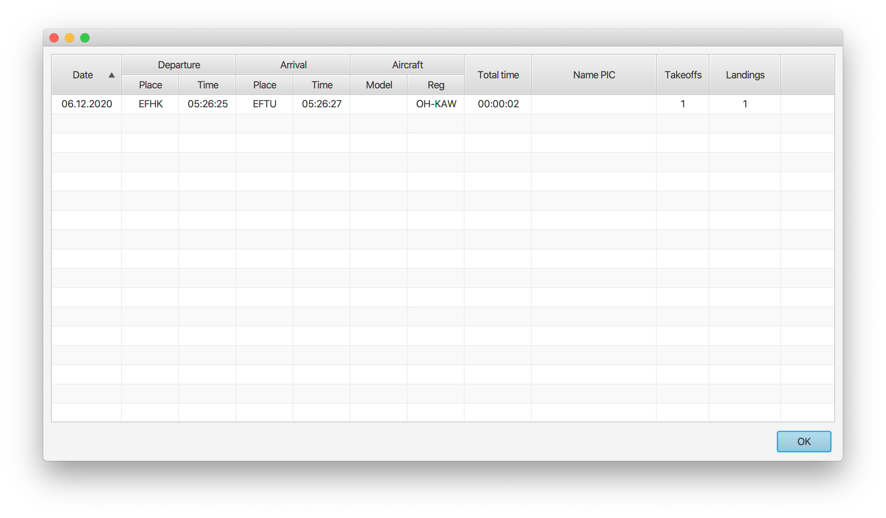

# Käyttöohje

Lataa tiedosto [FlightLogBook.jar](https://github.com/ptuomola/ot-harjoitustyo/releases/download/loppupalautus/FlightLogBook.jar)


## Ohjelman käynnistäminen

Ohjelma käynnistetään komennolla 

```
java -jar FlightLogBook.jar
```

## Kirjautuminen

Käynnistymisen jälkeen ohjelma näyttää "login"-näkymän järjestelmään kirjautumista varten:



Olemassaolevat käyttäjät voivat kirjautua kirjoittamalla käyttäjätunnuksensa ja salasanansa kenttiin ja painamalla "Login"-painiketta.

Uuden käyttäjän luomistilaan voidaan siirtyä painamalla "Create New User" painiketta.

## Uuden käyttäjän luominen

Uudelle käyttäjälle pitää antaa vähintään seuraavat tiedot:

- Käyttäjätunnus. Tämän pitää olla vähintään 3 kirjainta pitkä, ja sellainen joka ei ole jo toisen käyttäjän käytössä. 

- Salasana. Tämän pitää olla vähintään 8 merkkiä pitkä, sisältää vähintään yksi erikoismerkki, numero, pieni ja iso kirjain. 

Muut tiedot (koko nimi, sähköposti, syntymäpäivä) ovat vapaaehtoisia.



Käyttäjä luodaan painamalla "Register Pilot" painiketta. 

## Päänäkymä

Kirjautumisen jälkeen näkyy päänäkymä:



Tästä näkyvät:

- Lentojen määrä ja kokonaisaika - koko lokissa aikana ja viimeisen 12kk aikana
- Nousujen ja laskeutumisien määrä - koko lokissa ja viimeisen 3kk aikana
- Varoitukset, jos lentoluvan uusintaan tai matkustajien kuljettamiseen vaadittavat lento- ja laskeutumismäärät eivät täyty

Uusi lento voidaan aloittaa painamalla "Start New Flight" painiketta. 
Painikkeilla "View Aircraft", "View Flights", "View Airports" voidaan käydä läpi lokiin tallennettuja tietoja. 
Painikkeella "Logout" voidaan poistua sovelluksesta. 

## Lentojen tallentaminen

Painikkeen "Start New Flight" painaminen siirtää sovelluksen lennon talletustilaan. Tässä näkyy:

- Tämänhetkinen kellonaika (UTC)
- Kokonaismatkustusaika (Total time)
- Kokonaislentoaika (Flight time)
- Lähtö- ja saapumisaika (Departure ja Arrival time)
- Lentoonlähtö ja laskeutumisaika (Takeoff ja Landing time)
- Lentoonlähtöjen ja laskeutumisien määrä

Painamalla sinistä painiketta voidaan aina siirtyä yhdestä lennonvaiheesta seuraavaan. Painamalla "Touch and go" painiketta voidaan lentotilassa lisätä yksi läpilasku. Lentotilasta poistutaan painamalla sinistä painiketta lennon viimeisessä vaiheessa (eli laskeutumisen jälkeisen rullauksen päätyttyä). Lennon voi jättää kesken sulkemalla ikkunan (esim. Macissä punainen painike ylävasemmalla). 

Painamalla "Add flight details" painiketta voidaan siirtyä tallettamaan lisätietoja lennosta. 



## Lisätietojen tallennus

Lisätietojen tallennustilassa voidaan tallentaa lennolle:

- Lähtökenttä
- Kohdekenttä
- Lentokoneen rekisteritunnus

Lentäjän nimi tässä versiossa on aina lokin omistajan nimi. 

Takaisin lentotilaan voidaan palata painamalla "Save", joka tallettaa muutokset lentotietoihin.  Painamalla "Cancel" kaikki tehdyt muutokset hylätään. 



## Lokitietojen tutkinta

Pääikkunasta päästään myös tutkimaan lokikirjan eri tietoja:




